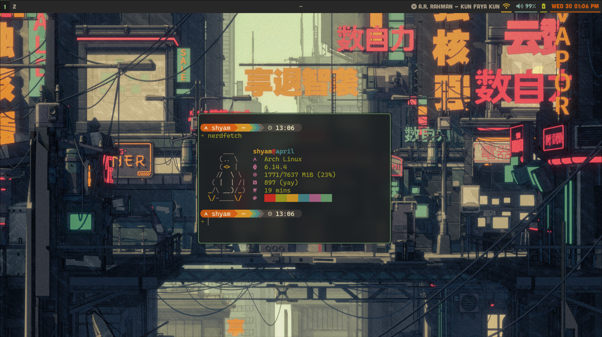

# 🌟 My Dotfiles 💻

These are my personal dotfiles for an Arch Linux + Hyprland setup. 🚀

## 📦 Applications

* **Window Manager:** Hyprland 🖼️
* **Terminal:** Kitty 🐱‍💻
* **Shell:** Zsh 🐚
* **Notification Daemon:** Dunst 🔔
* **Application Launcher:** Rofi 🔍
* **Shell Prompt:** Starship ⭐
* **Status Bar:** Waybar 📊
* **Logout Menu:** Wlogout 🚪
* **Text Editor:** Neovim (nvim) 📝

## 🎨 Theme

* Heavily based on the [Catppuccin Mocha](https://github.com/catppuccin/catppuccin) color scheme. ☕
* Inspired by [typecraft-dev](https://https://github.com/typecraft-dev)'s dotfiles. ✨

## 🖼️ Preview



## 🛠️ Installation

1.  Clone the repository:
    ```bash
    git clone [https://github.com/shyamjames/dotfiles](https://github.com/shyamjames/dotfiles) ~/.dotfiles
    ```
2.  Navigate to the cloned directory:
    ```bash
    cd ~/.dotfiles
    ```
3.  Copy the configuration files to their respective locations. For example:
    ```bash
    cp ~/.dotfiles/hypr/* ~/.config/hypr/
    cp ~/.dotfiles/kitty/* ~/.config/kitty/
    cp ~/.dotfiles/dunst/dunstrc ~/.config/dunst/dunstrc
    cp ~/.dotfiles/rofi/* ~/.config/rofi/
    cp ~/.dotfiles/waybar/* ~/.config/waybar/
    cp ~/.dotfiles/wlogout/* ~/.config/wlogout/
    cp ~/.dotfiles/nvim/* ~/.config/nvim/ 
    # if you have starship.toml in your dotfiles
    cp ~/.dotfiles/starship/starship.toml ~/.config/starship.toml
    ```
4.  Install the required packages:
    ```bash
    # using pacman
    sudo pacman -S hyprland kitty dunst rofi starship waybar wlogout neovim # add neovim to this line
    # additional packages required by the config files.
    yay -S ttf-cascadia-code-nerd # a nerd font 🤓
    ```
5.  Configure Starship by creating or editing `~/.config/starship.toml`
6.  Reboot or restart Hyprland to apply the changes. 🔄
7. If your nvim config uses plugins, install them using your plugin manager. (e.g. `packer`, `vim-plug`)
## 📋 Dependencies

* Arch Linux 🐧
* Hyprland 🖼️
* Kitty 🐱‍💻
* Dunst 🔔
* Rofi 🔍
* Zsh 🐚
* Starship ⭐
* Waybar 📊
* Wlogout 🚪
* Neovim (nvim) 📝

## 🙏 Credits

* [Catppuccin](https://github.com/catppuccin/catppuccin) ☕
* [typecraft-dev](https://github.com/typecraft-dev) ✨
